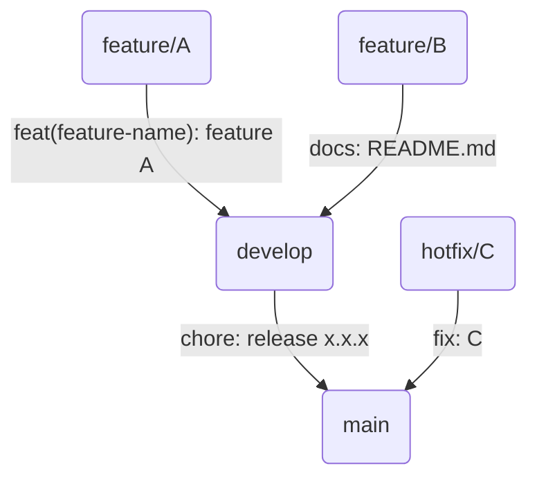

### Release Please

---

- `[**release-please**](https://github.com/googleapis/release-please)` 는 구글에서 만든 릴리즈 버전 관리 서비스이며, 다음의 역할을 수행합니다.

  - `**CHANGELOG` 를 생성하고 업데이트 합니다.
  - **Github Releases** **를 생성**합니다.

- `release-please` 를 채택하면서 다음과 같은 브랜치 관리 방식을 도입하게 되었습니다.

  ```mermaid
  flowchart TB

  r1(main)
  r2(develop)
  r3(feature/A)
  r4(feature/B)

  r3 -- "feat(feature-name): feature A" --> r2
  r4 -- docs: README.md --> r2
  r2 -- "chore: release x.x.x" --> r1
  ```

- 위 흐름은 다음과 같이 설명할 수 있습니다.
  1. `feature/A` 브랜치 작업 내용 PR을 `feat(feature-name): feature A` 로 생성
  2. `feature/B` 브랜치 작업 내용 PR을 `docs: README.md` 로 생성
  3. 두 브랜치 모두 `development` 브랜치에 **Squash and merge** 를 통해 병합
  4. 이후, `development` 브랜치 변경 사항을 `main` **Squash and merge** 를 통해 브랜치에 병합

# 개요

---



- 위 흐름을 보면 알 수 있듯이 일반적은 병합 경로는 크게 세 가지로 구분됩니다.
  - `feature` ⇒ `develop`
  - `hotfix` ⇒ `main`
  - `develop` ⇒ `main`
- 해당 작성법은 크게 두 가지의 흐름으로 구분지어 진행될 예정입니다.
  - **버전 업데이트 발생** : `develop` ⇒ `main`
  - **버전 업데이트 미발생** : 그 외
- 또한, 모든 병합은 기본적으로 **Squash and merge 방식**으로 진행됩니다.

# 버전 업데이트 미발생

---

> **버전 업데이트가 발생하지 않는 경우**로 `feature` 에서 `develop` 으로, `hotfix` 에서 `main` 으로 병합되는 경우가 이에 해당합니다.

## PR 생성

---


PR 생성시 마주하는 화면

- PR 제목은 [컨벤셔널 커밋](https://www.conventionalcommits.org/en/v1.0.0/)에 기반하여 작성합니다.
- 마지막으로 진행한 커밋은 반드시 **기준 브랜치로 `rebase` 를 진행합니다.**
  - 일반 `rebase` 및 인터랙티브 `rebase` 여부는 무관합니다.


병합 준비가 완료된 상태

- 빌드 테스트 성공적으로 마무리 되었다면 다음과 같은 화면을 확인하실 수 있습니다.

## 병합 커밋 작성

---


Squash and merge 버튼을 클릭하면 나타나는 Multi-line commit form

- 병합 버튼을 누르면 위와 같이 커밋을 작성할 수 있는 입력란이 등장합니다.
- 이때, 첫 번째 **커밋의 제목**이 앞에서 의도한 PR 제목과 다르다면 이를 수정하여 반영합니다.
- 이어지는 아래 설명란은 **[컨벤셔널 커밋](https://www.conventionalcommits.org/en/v1.0.0/)**에 기반하여 작성합니다.

## 결과 확인

---


`develop` 브랜치의 `README.md` 커밋 로그를 보면 반영한 `feat: example` 커밋이 추가된 것을 볼 수 있다

- 위와 같이 PR이 변경사항이 발생한 커밋에 추가되면 성공입니다.

# 버전 업데이트 발생

---

> **버전 업데이트가 발생하는 경우**로 `develop` 에서 `main` 으로 병합되는 경우가 이에 해당합니다.

<aside>
💡 앞의 PR 생성의 경우, 버전 업데이트 미발생의 경우와 동일하게 진행하시면 됩니다.

</aside>

## 병합 커밋 작성

---


업데이트 버전을 명시한 릴리즈 커밋

- 버전 업데이트가 발생하는 경우, 위와 같이 `chore` 타입으로 릴리즈 버전과 함께 커밋 제목을 작성합니다.
- 이어지는 아래 설명란에는 **[컨벤셔널 커밋](https://www.conventionalcommits.org/en/v1.0.0/)**에 기반하여 `main` 브랜치에 병합되는 이전 PR 리스트(PR 커밋들)를 작성합니다.
- 마지막으로, `Release-As: x.x.x` 형태의 명령어를 작성 함으로 업데이트 되는 버전을 명시해줍니다.

## 업데이트 로그 병합

---


- 성공적으로 `main` 에 병합되었다면 다음과 같이 깃허브 액션이 동작하고 새로운 PR이 생깁니다.


깃허브 액션이 성공하면 다음과 같이 새로운 PR이 생긴다.

- PR은 방금 깃허브 액션을 동작시킨 PR의 이름과 같습니다.


`CHANGELOG.md` 파일을 업데이트 시켜줄 PR 생성

- 위 PR을 보면 앞에서 추가했던 `feature/example` 커밋을 포함하여 배포 커밋까지 표기된 내용을 확인할 수 있습니다.
- 해당 PR은 `main` 으로 병합되면서 `CHANGELOG` 를 업데이트 합니다.
- 이때도, 역시 **Squash and merge** 를 진행합니다.

## 결과 확인

---


배포와 함께 업데이트 된 파일이 마지막 커밋과 함께 반영되어 있으며 `CHANGELOG` 가 업데이트 되었다.

- 위와 같이 병합 사항이 반영된 파일에 커밋이 작성되고 `CHANGELOG` 가 업데이트 되었다면 성공입니다.
